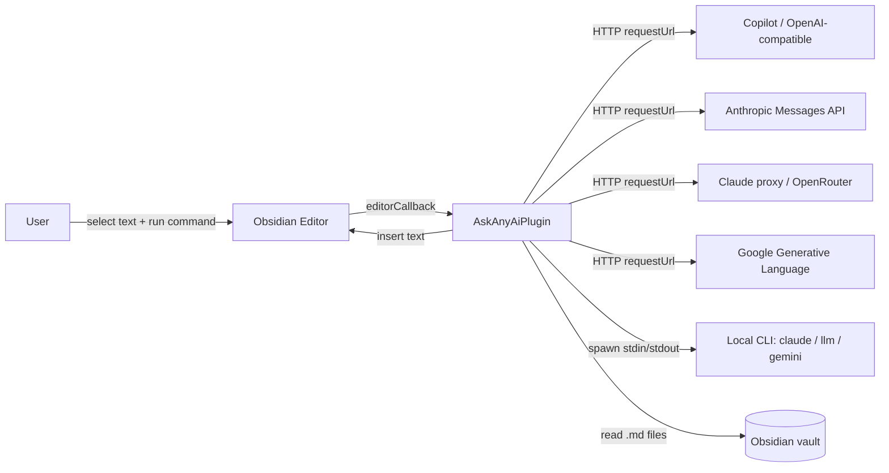

# System context

## What the plugin does

Ask Any AI adds **one** Obsidian command — *Ask AI* — that takes the user's selected text (or current line), optionally expands `[[wikilinks]]` and a system prompt, sends the payload to a configured LLM provider, and inserts the response back into the same note at a configurable position.

The entire feature is built around a single command pipeline. There are no background workers, no telemetry, no automatic file writes outside the active editor.

## Runtime context

All network calls go through Obsidian's `requestUrl` helper (CORS-safe, runs in the host process). The CLI provider uses Node's `child_process.spawn`, which is why the plugin is **desktop-only**.

## Constraints

- **Desktop only** — `isDesktopOnly: true` in [manifest.json](../../manifest.json) because [src/core/llmClient.ts:3](../../src/core/llmClient.ts:3) imports `child_process` for the CLI provider.
- **Minimum Obsidian version** — `1.5.0` (see [manifest.json](../../manifest.json)).
- **Single bundled artefact** — `main.js` is produced by esbuild from [src/main.ts](../../src/main.ts); no unbundled runtime dependencies.
- **No telemetry, no auto-update** — only network calls are the explicit LLM provider requests.

## Process boundaries

| Boundary | Crosses | Mechanism |
|---|---|---|
| Plugin ↔ Obsidian | In-process | Obsidian Plugin API |
| Plugin ↔ Vault | In-process | `app.vault.read`, `getMarkdownFiles`, `metadataCache` |
| Plugin ↔ Provider HTTP | Network | `requestUrl` from `obsidian` module |
| Plugin ↔ CLI | Subprocess | `spawn` from Node `child_process` |

The plugin reads vault content (active note + linked notes + optional vault-wide note list) but only writes to the **active editor** — never to disk directly.
