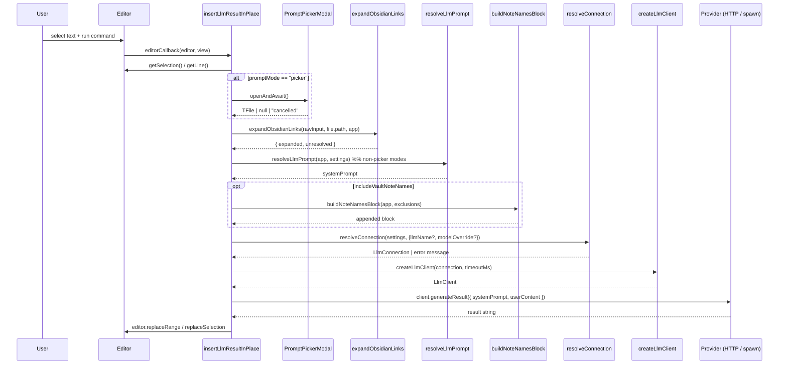

# Command pipeline

The single command *Ask AI* runs the function `insertLlmResultInPlace` in [src/commands/insertResult.ts](../../src/commands/insertResult.ts). The pipeline is linear with explicit progress checkpoints.

## Sequence diagram

## The 9 steps with progress percentages

| Step | Code reference | Progress | Action |
|---|---|---|---|
| 1. Read input scope | [insertResult.ts:58](../../src/commands/insertResult.ts:58) | — | Selection or current line; abort if empty |
| 2. Open picker (if `picker` mode) | [insertResult.ts:69](../../src/commands/insertResult.ts:69) | — | Modal *before* progress UI to avoid covering it |
| 3. Expand Obsidian links | [insertResult.ts:83](../../src/commands/insertResult.ts:83) | 10 % | Replace `[[...]]` with content |
| 4. Resolve system prompt | [insertResult.ts:90](../../src/commands/insertResult.ts:90) | 20 % | Picker file content, or `resolveLlmPrompt` |
| 4.5. Append note-names block | [insertResult.ts:99](../../src/commands/insertResult.ts:99) | 25 % | Only when `includeVaultNoteNames` |
| 5. Resolve connection | [insertResult.ts:106](../../src/commands/insertResult.ts:106) | — | `resolveConnection` → `validateConnection`; abort on missing credentials |
| 6. Call LLM | [insertResult.ts:118](../../src/commands/insertResult.ts:118) | 30 → 50 % | `createLlmClient(connection, timeoutMs).generateResult(...)` |
| 7. Build insertion block | [insertResult.ts:130](../../src/commands/insertResult.ts:130) | 85 % | Optional debug block + heading + result |
| 8. Insert into editor | [insertResult.ts:151](../../src/commands/insertResult.ts:151) | 95 % | Position-dependent `replaceRange` / `replaceSelection` |
| 9. Done | [insertResult.ts:163](../../src/commands/insertResult.ts:163) | 100 % | `progress.complete()` (auto-hides after 1 s) |

## Insertion modes (step 8)

`settings.insertPosition` selects which Obsidian Editor API is used:

| Mode | Code reference | Behaviour |
|---|---|---|
| `end-of-file` | [insertResult.ts:153](../../src/commands/insertResult.ts:153) | `editor.replaceRange(block, { line: lastLine + 1, ch: 0 })` |
| `at-cursor` | [insertResult.ts:156](../../src/commands/insertResult.ts:156) | `editor.replaceSelection(block)` (replaces the selection) |
| `after-selection` *(default)* | [insertResult.ts:158](../../src/commands/insertResult.ts:158) | `editor.replaceRange(block, { line: cursor.line + 1, ch: 0 })` — inserts on the line after the selection's end |

## Error paths

| Failure | Where caught | User feedback |
|---|---|---|
| No active file | [insertResult.ts:52](../../src/commands/insertResult.ts:52) | `Notice("No active file")` |
| Empty selection and empty line | [insertResult.ts:63](../../src/commands/insertResult.ts:63) | `Notice("Nothing to send to AI Agent")` |
| Picker cancelled | [insertResult.ts:72](../../src/commands/insertResult.ts:72) | `Notice("Cancelled")` |
| Unresolved wikilinks | [insertResult.ts:85](../../src/commands/insertResult.ts:85) | `Notice("Could not resolve links: ...")` (non-fatal — pipeline continues) |
| Missing credentials / bad URL | [insertResult.ts:106](../../src/commands/insertResult.ts:106) via `resolveConnection` / `validateConnection` | Notice with the specific hint |
| Empty LLM result | [insertResult.ts:123](../../src/commands/insertResult.ts:123) | `Notice("AI returned empty result")` |
| Any thrown error (HTTP, spawn, CLI exit code, timeout) | [insertResult.ts:164](../../src/commands/insertResult.ts:164) | `console.error(e)` + `Notice("Error while calling AI, see console")` |

The picker is opened **before** the progress indicator ([insertResult.ts:68](../../src/commands/insertResult.ts:68)) on purpose — otherwise the modal would render on top of the progress notice and obscure it.
