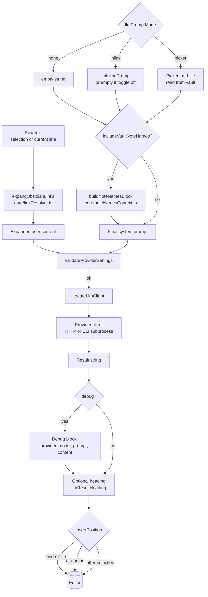

# Data flow

This diagram shows how the four input streams (raw user text, prompt source, vault note list, settings) merge into one provider request and one editor insertion.



## Three streams that merge into the request

| Stream | Source | Transformation | Result |
|---|---|---|---|
| **User content** | `editor.getSelection()` or `editor.getLine(line)` | `expandObsidianLinks` replaces every `[[...]]` with the linked file/section/block content | `expanded: string` |
| **System prompt** | `llmPromptMode` decides: empty / inline / picker file | When `includeVaultNoteNames`, append `buildNoteNamesBlock(...)` joined with `\n\n` | `systemPrompt: string` |
| **Provider settings** | `llmProvider`, credentials, `llmModel`, `timeoutMs` | `validateProviderSettings` + `createLlmClient` | `LlmClient` instance |

These three feed `client.generateResult({ systemPrompt, userContent })` ([insertResult.ts:121](../../src/commands/insertResult.ts:121)).

## What gets inserted

The block assembled at [insertResult.ts:132](../../src/commands/insertResult.ts:132) follows this exact layout:

```
\n\n
[debug block, only if settings.debug]
## <llmResultHeading>     ← omitted if heading is empty after trim
\n\n
<result>
\n
```

The debug block (when enabled) contains:

```
## AI Request (debug)

**Provider:** <llmProvider>
**Model:** <llmModel or "(default)">

### System prompt

```text
<systemPrompt>
```

### User content

```text
<expanded>
```
```

The fenced ` ```text ` blocks ensure that any Markdown inside the system prompt or user content is not re-rendered by Obsidian — see [Debug mode](../03-features/debug-mode.md).

## Insertion target

`settings.insertPosition` selects exactly one of three Editor API calls:

- `"end-of-file"` → `editor.replaceRange(block, { line: lastLine + 1, ch: 0 })`
- `"at-cursor"` → `editor.replaceSelection(block)` (replaces the selection)
- `"after-selection"` → `editor.replaceRange(block, { line: cursor.line + 1, ch: 0 })` where `cursor` is `getCursor("to")`

See [insertResult.ts:152](../../src/commands/insertResult.ts:152) for the dispatch.
