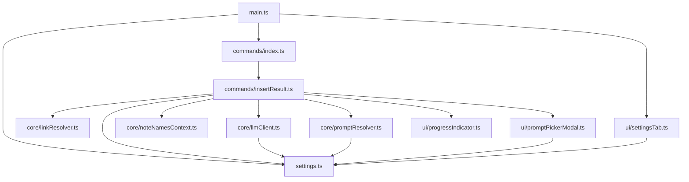

# Module map

## `src/` tree and per-file responsibility

```
src/
├── main.ts                        Plugin entrypoint — lifecycle only
├── settings.ts                    AiAssistantSettings interface, DEFAULT_SETTINGS, types
├── commands/
│   ├── index.ts                   registerCommands() — single editor command
│   └── insertResult.ts            insertLlmResultInPlace() — the 9-step pipeline
├── core/
│   ├── llmClient.ts               Five provider clients + createLlmClient() factory
│   ├── linkResolver.ts            expandObsidianLinks() — wikilink expansion
│   ├── promptResolver.ts          resolveLlmPrompt() — none/inline/picker dispatch
│   └── noteNamesContext.ts        buildNoteNamesBlock() — vault enumeration
└── ui/
    ├── settingsTab.ts             AiAssistantSettingTab — settings UI
    ├── promptPickerModal.ts       PromptPickerModal — runtime prompt picker
    └── progressIndicator.ts       showProgressIndicator() — Notice-based progress
```

## Per-file responsibility

| File | Exports | Responsibility |
|---|---|---|
| [src/main.ts](../../src/main.ts) | `AiAssistantPlugin` (default) | `onload`, `loadSettings` (with legacy migration), `saveSettings` |
| [src/settings.ts](../../src/settings.ts) | `AiAssistantSettings`, `LlmProvider`, `DEFAULT_SETTINGS` | Shape of persisted settings + defaults |
| [src/commands/index.ts](../../src/commands/index.ts) | `registerCommands` | Wire the single command to Obsidian |
| [src/commands/insertResult.ts](../../src/commands/insertResult.ts) | `insertLlmResultInPlace` | End-to-end command pipeline |
| [src/core/llmClient.ts](../../src/core/llmClient.ts) | `LlmClient`, `LlmRequest`, `CopilotClient`, `ClaudeClient`, `ClaudeProxyClient`, `GeminiClient`, `CliClient`, `createLlmClient` | Provider abstraction + factory |
| [src/core/linkResolver.ts](../../src/core/linkResolver.ts) | `expandObsidianLinks`, `LinkExpansionResult` | Replace `[[Note]]` / `[[Note#H]]` / `[[Note#^id]]` with content |
| [src/core/promptResolver.ts](../../src/core/promptResolver.ts) | `resolveLlmPrompt` | Map `llmPromptMode` to a system-prompt string |
| [src/core/noteNamesContext.ts](../../src/core/noteNamesContext.ts) | `buildNoteNamesBlock`, `patternToRegex`, `matchesExclusionPattern` | Vault note list + glob exclusions |
| [src/ui/settingsTab.ts](../../src/ui/settingsTab.ts) | `AiAssistantSettingTab` | The 5-section settings UI |
| [src/ui/promptPickerModal.ts](../../src/ui/promptPickerModal.ts) | `PromptPickerModal` | `SuggestModal` for runtime prompt selection |
| [src/ui/progressIndicator.ts](../../src/ui/progressIndicator.ts) | `showProgressIndicator`, `ProgressController` | `Notice`-based progress UI |

## Dependency graph



## External dependencies

- `obsidian` — `Plugin`, `App`, `Editor`, `TFile`, `Notice`, `SuggestModal`, `requestUrl`, `normalizePath`, `CachedMetadata`
- `child_process` (Node) — `spawn`, used only by [src/core/llmClient.ts:3](../../src/core/llmClient.ts:3) for `CliClient`

There are no third-party runtime dependencies; everything in `dependencies` is bundled into `main.js` by esbuild.

## Layering rules

- `main.ts` only knows about lifecycle and the registration entry points.
- `commands/` orchestrate but never reach into UI internals; UI is invoked only through factory/modal entry points.
- `core/` modules are pure (no UI, no Obsidian DOM) — they take `App` + plain inputs and return data.
- `ui/` modules render — they don't contain pipeline logic.
- `settings.ts` is a leaf module: every other module may import it; it imports no other plugin module.
