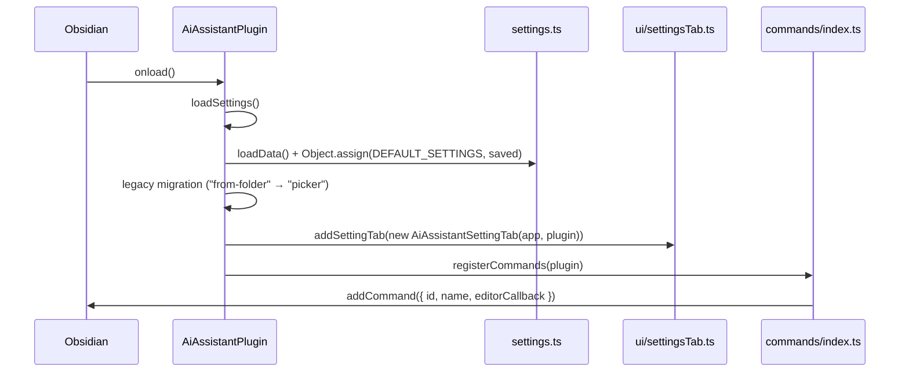

# Plugin lifecycle

The plugin entrypoint is [src/main.ts](../../src/main.ts) — class `AiAssistantPlugin` extending Obsidian's `Plugin`.

## `onload()`



Sequence in code ([src/main.ts:9](../../src/main.ts:9)):

1. `await this.loadSettings()`
2. `this.addSettingTab(new AiAssistantSettingTab(this.app, this))`
3. `registerCommands(this)`

That is the entire `onload`. There is no `onunload` override — Obsidian's default cleanup is sufficient because everything that requires teardown (commands, settings tab) is registered through Obsidian APIs that are auto-disposed on plugin unload.

## Settings load and persistence

[src/main.ts:15](../../src/main.ts:15)

```ts
const saved = await this.loadData();
this.settings = Object.assign({}, DEFAULT_SETTINGS, saved);
```

- Defaults from [src/settings.ts:48](../../src/settings.ts:48) provide every field, so settings always satisfy the `AiAssistantSettings` interface even before the user opens the settings tab.
- `Object.assign({}, DEFAULT_SETTINGS, saved)` is shallow — array fields like `vaultNoteNamesExclusions` are replaced wholesale by the saved value (not merged).

### Legacy migration

[src/main.ts:20](../../src/main.ts:20) detects the deprecated `"from-folder"` value for `llmPromptMode` and rewrites it to `"picker"`. The migration is one-shot and writes back via `saveSettings()` so the legacy value never reappears.

This migration was introduced when the static "prompt from a fixed folder" behaviour was replaced with an interactive picker (see [Prompt resolution](../03-features/prompt-resolution.md)).

## Command registration

[src/commands/index.ts](../../src/commands/index.ts)

```ts
plugin.addCommand({
  id: "insert-ai-result",
  name: "Ask AI",
  editorCallback: async (editor, view) => { ... },
});
```

Two important details:

- **Stable command ID** — `insert-ai-result` must never change after release (per [AGENTS.md](../../AGENTS.md) "Commands & settings" rules).
- **`editorCallback` (not `callback`)** — using `editorCallback` lets Obsidian decide whether the command is enabled and supplies `editor` + `view` automatically. The original code used `callback`, which prevented the command from appearing in the palette in some contexts; switching to `editorCallback` was the fix.

## Why there is no explicit `onunload`

The plugin only registers:

- **One command** via `addCommand` — Obsidian removes it on unload.
- **One settings tab** via `addSettingTab` — Obsidian removes it on unload.
- **Per-call** progress notices and modals — they manage their own lifecycle (the picker resolves a promise on close; the progress indicator clears its interval on `complete()` / `close()`).

No event listeners, intervals, or DOM observers are registered at the plugin scope, so there is nothing to tear down.
